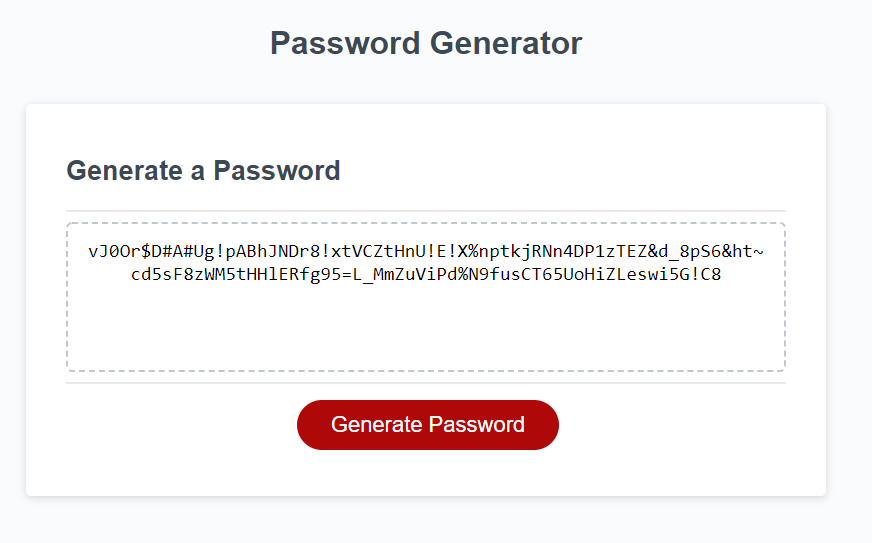

# Password_Generator

## Description
```
This application generates random password based on some criteria that user chooses from the list of choices presented to them.
```

## Functioning of the application
```
Based on these two user input information, the password generator generates random password strings:
1) The user is presented with below criteria to choose from:
    * lowercase characters
    * uppercase characters
    * Numbers
    * Special Characters (~,@,#,$,&,%,-,+,=,_,!)
    The user should choose one or more of the above choices, from which the base string list will be build from, for password generation.
2) The user is also presented to choose password length between 8 adn 128 characters.

```

## Learning goal from this project as a developer

```
* Using Javascript to make the application/website interactive with the front-end users
* Usage of Prompts and user response
* Proper validation of front-end user inputs
* Usage of Functions
* Usage of predefined functions (Math)
```

## ScreenShot

```
The following image shows the web application's appearance with the random password generated and displayed in the textarea:



```

## URL for deployed application and GitHub repo

```
* The URL of the deployed application - https://meenaambalam.github.io/Password_Generator/
* The URL of the GitHub repository - https://github.com/meenaambalam/Password_Generator

```
